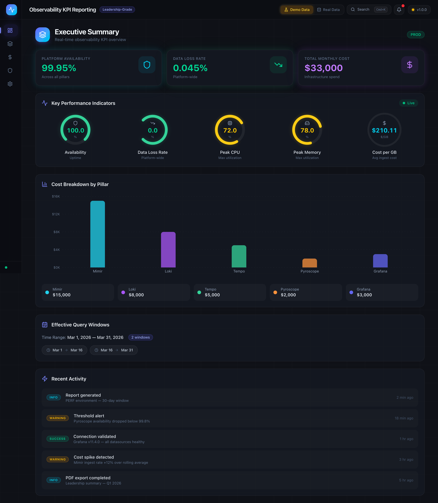
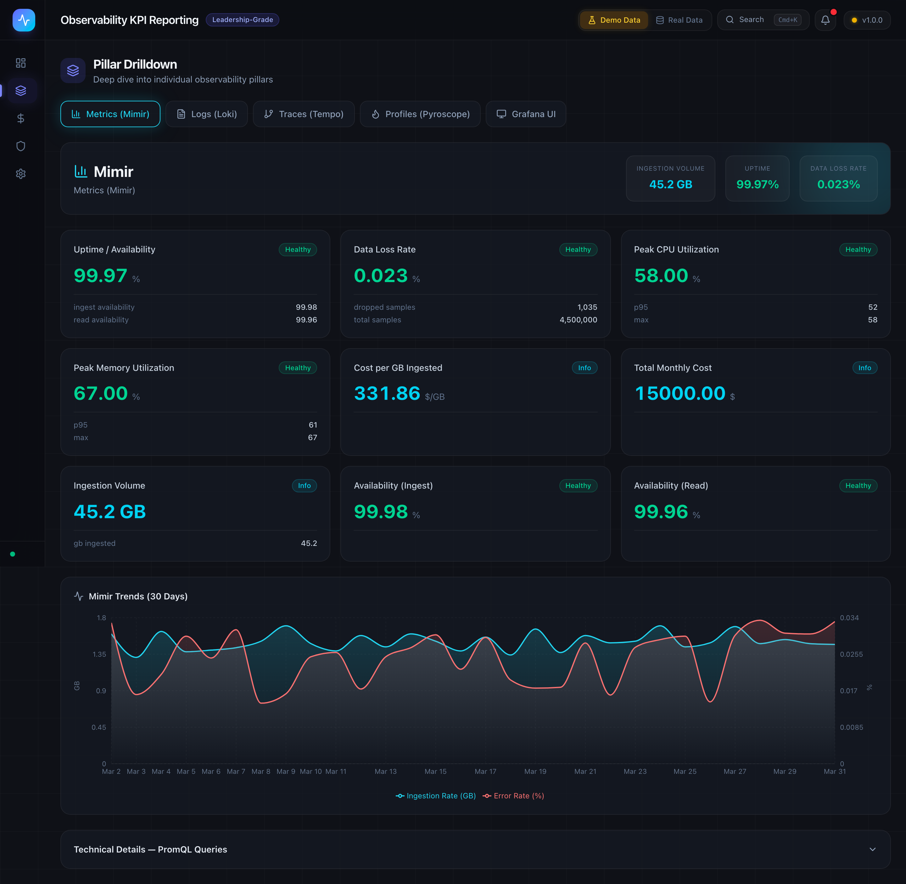
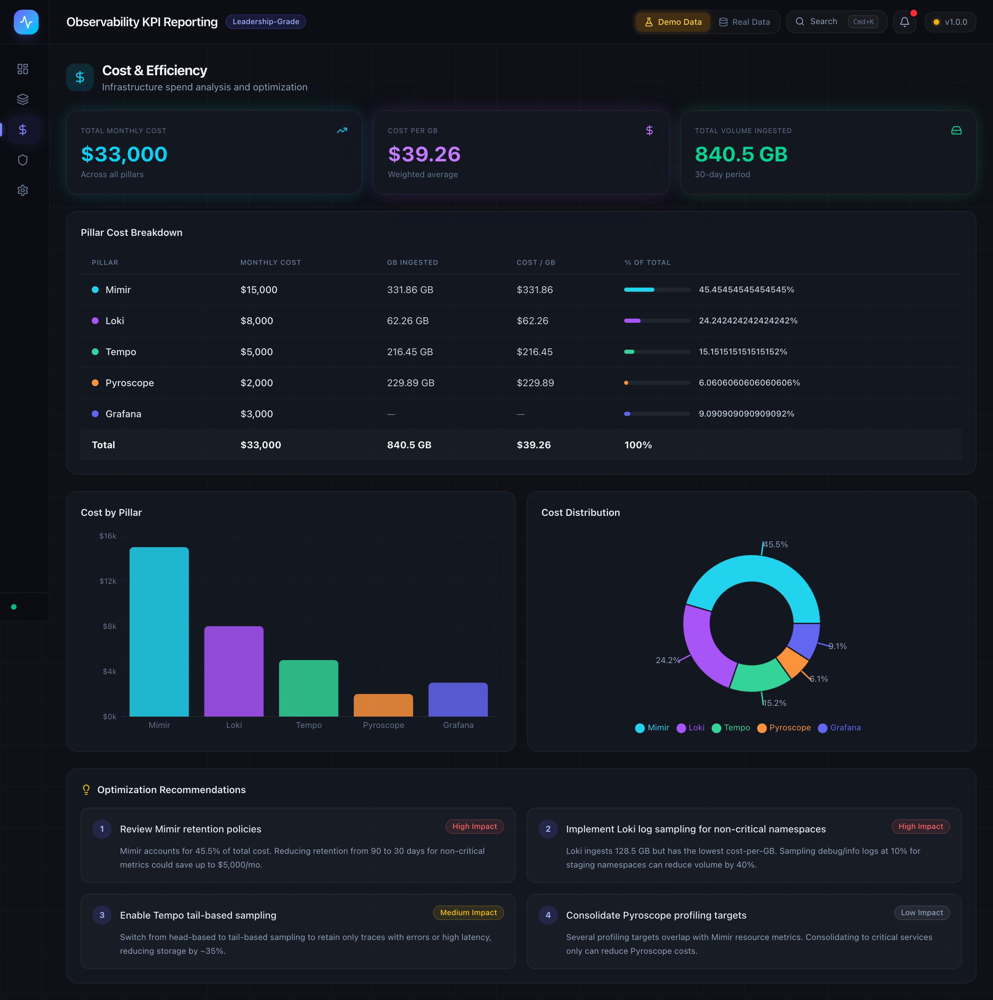
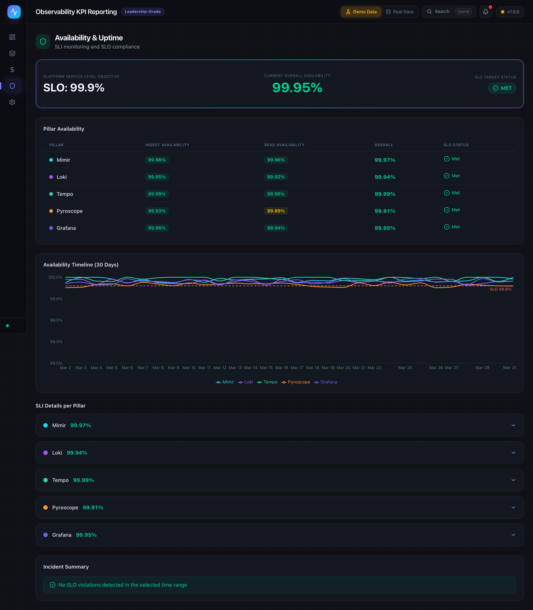
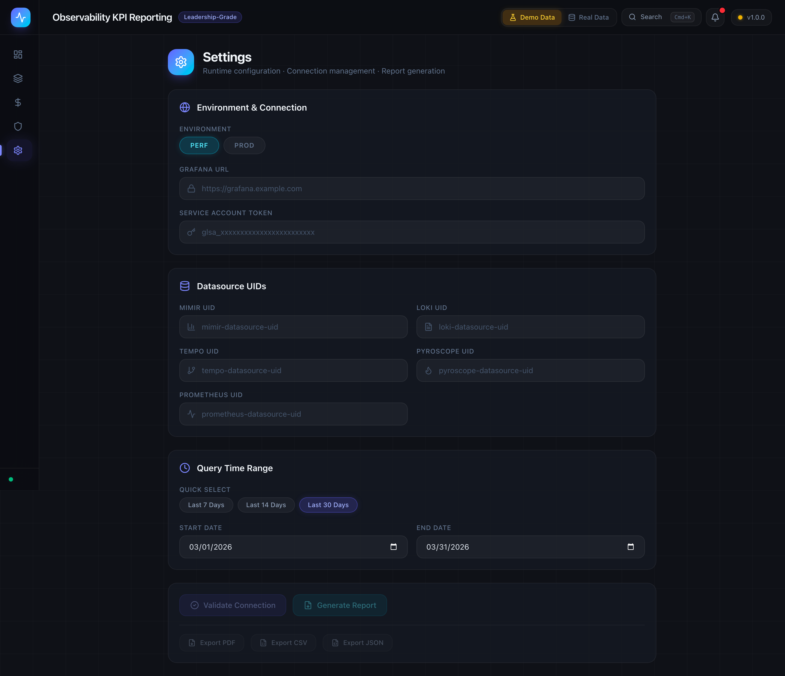
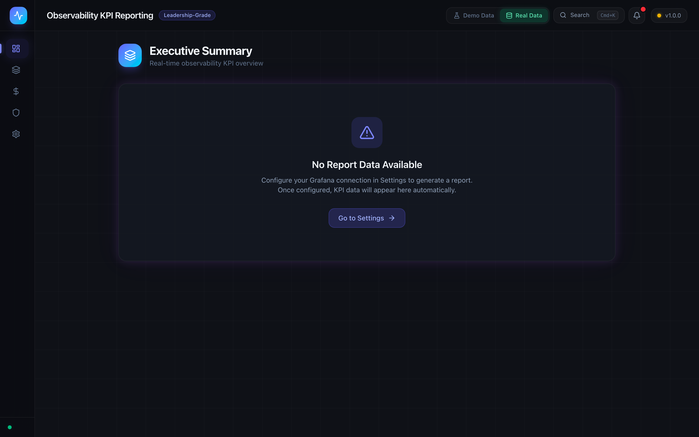

# Observability KPI Reporting Application

Enterprise-grade observability KPI dashboard for leadership reporting. Connects to Grafana Enterprise and computes KPIs across Mimir, Loki, Tempo, Pyroscope, and Grafana UI pillars.

---

## Screenshots

### Executive Summary (Demo Data)


### Pillar Drilldown


### Cost & Efficiency


### Availability & Uptime


### Settings & Configuration


### Empty State (No Data Configured)


---

## Quick Start (One Click)

```bash
# Start everything
make up

# Stop everything
make down
```

This builds and starts both containers:
- **Frontend** — http://localhost:3000
- **Backend API** — http://localhost:8000
- **API Docs (Swagger)** — http://localhost:8000/docs

---

## User Guide

### Step 1: Launch the Application

```bash
git clone https://github.com/gpadidala/Observability-KPI.git
cd Observability-KPI
make up
```

Open **http://localhost:3000** in your browser.

### Step 2: Choose Data Mode

In the **top-right header**, you'll see two toggle buttons:

| Button | Icon | Description |
|--------|------|-------------|
| **Demo Data** | Flask (amber) | Loads realistic sample data instantly. No Grafana connection needed. Perfect for exploring the dashboard. |
| **Real Data** | Database (green) | Uses live data from your Grafana instance. Requires configuration in Settings. |

Click **Demo Data** to immediately see the full dashboard with sample KPIs across all pillars.

### Step 3: Explore the Dashboard Pages

#### Executive Summary (`/`)

The landing page shows a high-level overview:

- **Hero Stats** — Platform Availability, Data Loss Rate, Total Monthly Cost
- **KPI Gauges** — Circular gauges for Availability, Data Loss, Peak CPU, Peak Memory, Cost per GB
- **Cost Bar Chart** — Visual cost breakdown by observability pillar
- **Query Windows** — Transparency section showing the time windows used
- **Activity Feed** — Recent events and alerts

#### Pillar Drilldown (`/pillar-drilldown`)

Deep dive into individual pillars:

1. Click a **pillar tab** (Mimir, Loki, Tempo, Pyroscope, Grafana)
2. View per-pillar KPIs: Data Loss Rate, Ingestion Volume, Ingest/Read Availability, Peak CPU/Memory
3. See **trend charts** for ingestion rate and error rate over time
4. Expand **Technical Details** to see the actual PromQL queries used

#### Cost & Efficiency (`/cost-efficiency`)

Infrastructure spend analysis:

- **Hero Cards** — Total Monthly Cost, Cost per GB, Total Volume Ingested
- **Breakdown Table** — Per-pillar cost with GB ingested, Cost/GB, and % of total (with visual progress bars)
- **Charts** — Bar chart and pie chart for visual cost distribution
- **Optimization Recommendations** — Actionable cost reduction suggestions

#### Availability & Uptime (`/availability`)

SLO compliance monitoring:

- **SLO Compliance Badge** — Overall platform availability vs 99.9% target
- **Pillar Table** — Ingest Availability, Read Availability, Overall, SLO status per pillar
- **Timeline Chart** — 30-day availability trend per pillar with SLO reference line
- **SLI Details** — Expandable cards showing success/total request counts and error budget remaining
- **Incident Summary** — Highlights any SLO violations

### Step 4: Connect to Real Grafana (Optional)

To use live data from your Grafana Enterprise instance:

1. Click **Real Data** toggle in the header
2. Navigate to **Settings** (gear icon in sidebar)
3. Fill in the configuration:

| Field | Description | Example |
|-------|-------------|---------|
| **Environment** | PERF or PROD | `PROD` |
| **Grafana URL** | Your Grafana base URL | `https://grafana.company.com` |
| **Service Account Token** | Grafana SA token (read-only) | `glsa_xxxxxxxxxxxx` |
| **Mimir UID** | Datasource UID for Mimir | `mimir-ds` |
| **Loki UID** | Datasource UID for Loki | `loki-ds` |
| **Tempo UID** | Datasource UID for Tempo | `tempo-ds` |
| **Pyroscope UID** | Datasource UID for Pyroscope | `pyroscope-ds` |
| **Prometheus UID** | Datasource UID for Prometheus | `prometheus-ds` |

4. Select a **time range** (Last 7/14/30 days, or custom)
5. Click **Validate Connection** — confirms Grafana is reachable
6. Click **Generate Report** — fetches live KPIs and redirects to dashboard

> **Note:** If your time range exceeds 30 days, queries are automatically chunked into 30-day windows and aggregated.

### Step 5: Export Reports

On the Settings page, after generating a report:

| Button | Format | Description |
|--------|--------|-------------|
| **Export PDF** | `.pdf` | Leadership-ready report with executive summary, per-pillar tables, and cost breakdown |
| **Export CSV** | `.csv` | Tabular data for spreadsheet analysis |
| **Export JSON** | `.json` | Machine-readable format for automation pipelines |

---

## Architecture

```
┌─────────────────────────────────────────────────────────┐
│                      Browser                             │
│  ┌─────────────────────────────────────────────────┐    │
│  │         Next.js 15 Frontend (Port 3000)          │    │
│  │  ┌───────────┐ ┌────────────┐ ┌──────────────┐  │    │
│  │  │ Dashboard  │ │ Drilldown  │ │  Settings    │  │    │
│  │  │ Cost/Avail │ │ + Charts   │ │  + Config    │  │    │
│  │  └───────────┘ └────────────┘ └──────────────┘  │    │
│  │  Tailwind CSS 4 · Framer Motion · Recharts       │    │
│  └────────────────────┬────────────────────────────┘    │
│                       │ /api/* (proxy)                   │
│  ┌────────────────────▼────────────────────────────┐    │
│  │         FastAPI Backend (Port 8000)               │    │
│  │  ┌──────────┐ ┌───────────┐ ┌────────────────┐  │    │
│  │  │ Grafana   │ │ Time      │ │ KPI Engines    │  │    │
│  │  │ Client    │ │ Chunker   │ │ (5 calculators)│  │    │
│  │  └─────┬────┘ └───────────┘ └────────────────┘  │    │
│  │        │                                          │    │
│  │  ┌─────▼──────────────────────────────────────┐  │    │
│  │  │         Report Generator (PDF/CSV/JSON)     │  │    │
│  │  └────────────────────────────────────────────┘  │    │
│  └────────────────────┬────────────────────────────┘    │
└───────────────────────┼─────────────────────────────────┘
                        │ HTTPS (Bearer Token)
           ┌────────────▼──────────────┐
           │   Grafana Enterprise       │
           │   ┌───────┐ ┌───────────┐ │
           │   │ Mimir  │ │   Loki    │ │
           │   │(metrics)│ │  (logs)   │ │
           │   ├───────┤ ├───────────┤ │
           │   │ Tempo  │ │ Pyroscope │ │
           │   │(traces)│ │(profiles) │ │
           │   └───────┘ └───────────┘ │
           └───────────────────────────┘
```

---

## KPIs Computed

### 1. Data Loss Rate (DLR)

**Formula:** `(Dropped Events / Total Events) x 100`

| Pillar | Dropped Metric | Total Metric |
|--------|---------------|--------------|
| Mimir | `cortex_discarded_samples_total` | `cortex_ingester_samples_total` |
| Loki | `loki_discarded_entries_total` | `loki_ingester_entries_total` |
| Tempo | `tempo_discarded_spans_total` | `tempo_ingester_spans_received_total` |
| Pyroscope | `pyroscope_discarded_profiles_total` | `pyroscope_ingested_profiles_total` |

### 2. Cost per GB Ingested

**Formula:** `Total Monthly Infra Cost / Total GB Ingested`

Sources: Flexera API (or mock) for costs, Prometheus for ingestion volume.

### 3. Peak Resource Utilization

Queries `container_cpu_usage_seconds_total` and `container_memory_working_set_bytes` with `max_over_time` and `quantile_over_time(0.95, ...)`.

### 4. Monthly Infrastructure Cost Split

Per-pillar cost breakdown: Metrics (Mimir), Logs (Loki), Traces (Tempo), Profiles (Pyroscope), Grafana UI.

### 5. Uptime per Pillar (Availability)

Per-pillar SLIs for both ingest and read paths. Computed as `(successful_requests / total_requests) x 100`.

---

## Time Range Management

All observability backends have a **30-day maximum query window**. The application handles this transparently:

| User Selects | System Behavior |
|-------------|-----------------|
| <= 30 days | Single query window |
| 31-60 days | 2 chunked windows, results aggregated |
| 61-90 days | 3 chunked windows |
| Any range | Automatic chunking at 30-day boundaries |

**Aggregation strategies by metric type:**

| Metric Type | Strategy | Example |
|------------|----------|---------|
| Counter | Sum across chunks | Dropped samples |
| Gauge (max) | Max across chunks | Peak CPU |
| Gauge (P95) | Merge + recompute | P95 memory |
| Rate | Sum(num)/Sum(den) | Availability |

Effective query windows are displayed transparently in every report and dashboard view.

---

## Security

- Service account tokens provided at runtime via UI — **never stored permanently**
- Tokens sent only in request body to backend — **never in URLs or browser storage**
- Backend uses `SecretStr` (Pydantic) — **tokens never appear in logs**
- All Grafana API calls are **read-only**
- No hardcoded URLs, tokens, or credentials anywhere in the codebase

---

## API Reference

| Method | Endpoint | Description |
|--------|----------|-------------|
| `GET` | `/api/v1/health` | Health check |
| `POST` | `/api/v1/validate-connection` | Test Grafana connectivity |
| `POST` | `/api/v1/kpis` | Compute all KPIs across all pillars |
| `POST` | `/api/v1/kpis/{pillar}` | Compute KPIs for a specific pillar |
| `POST` | `/api/v1/report` | Generate downloadable report (PDF/CSV/JSON) |

**Request body** (for KPI endpoints):

```json
{
  "environment": "PROD",
  "grafana_url": "https://grafana.example.com",
  "service_account_token": "glsa_xxxxxxxxxxxx",
  "datasource_uids": {
    "mimir": "mimir-ds-uid",
    "loki": "loki-ds-uid",
    "tempo": "tempo-ds-uid",
    "pyroscope": "pyroscope-ds-uid",
    "prometheus": "prometheus-ds-uid"
  },
  "time_range_start": "2026-03-01T00:00:00Z",
  "time_range_end": "2026-03-31T00:00:00Z"
}
```

---

## Project Structure

```
observability-kpi/
├── backend/
│   ├── main.py                    # FastAPI entry point
│   ├── requirements.txt           # Python dependencies
│   ├── Dockerfile                 # Python 3.12 container
│   ├── api/
│   │   ├── models.py              # Pydantic request/response models
│   │   └── routes.py              # API endpoints
│   ├── clients/
│   │   ├── grafana_client.py      # Async Grafana API client
│   │   └── prometheus_client.py   # PromQL executor with chunking
│   ├── time_window/
│   │   └── chunker.py             # 30-day window splitting engine
│   ├── kpis/
│   │   ├── base.py                # Abstract KPI calculator
│   │   ├── data_loss_rate.py      # DLR calculator
│   │   ├── cost_per_gb.py         # Cost/GB calculator
│   │   ├── peak_resource_utilization.py
│   │   ├── infra_cost_split.py    # Cost split calculator
│   │   ├── uptime.py              # Availability calculator
│   │   └── calculator.py          # KPI orchestrator
│   └── reports/
│       └── generator.py           # PDF/CSV/JSON report generation
├── frontend/
│   ├── package.json               # Next.js 15 + React 19
│   ├── Dockerfile                 # Multi-stage Node 20 build
│   ├── next.config.ts             # API proxy + standalone output
│   ├── src/
│   │   ├── app/
│   │   │   ├── layout.tsx         # Root layout (Sidebar + Header)
│   │   │   ├── page.tsx           # Executive Summary dashboard
│   │   │   ├── pillar-drilldown/  # Per-pillar deep dive
│   │   │   ├── cost-efficiency/   # Cost analysis
│   │   │   ├── availability/      # SLO compliance
│   │   │   ├── settings/          # Configuration & report generation
│   │   │   ├── error.tsx          # Error boundary
│   │   │   ├── global-error.tsx   # Global error boundary
│   │   │   └── globals.css        # Tailwind + glass-morphism design system
│   │   ├── components/
│   │   │   ├── sidebar.tsx        # Collapsible navigation
│   │   │   ├── header.tsx         # Demo/Real toggle + health status
│   │   │   ├── glass-card.tsx     # Animated glass-morphism card
│   │   │   ├── metric-gauge.tsx   # SVG circular gauge
│   │   │   └── sparkline.tsx      # Recharts mini area chart
│   │   └── lib/
│   │       ├── api.ts             # API client + type definitions
│   │       ├── utils.ts           # Formatters + color helpers
│   │       ├── use-report-data.ts # Shared data hook (demo/real)
│   │       └── demo-data.ts       # Demo data generator
│   └── public/
├── tests/
│   ├── test_time_window_chunker.py  # 39 tests
│   ├── test_kpi_calculations.py     # 22 tests
│   ├── test_report_generator.py     # 20 tests
│   └── test_models.py              # 17 tests
├── docs/
│   └── screenshots/               # Auto-captured UI screenshots
├── docker-compose.yml             # One-click deployment
├── Makefile                       # make up / make down
└── README.md                      # This file
```

---

## Tech Stack

| Layer | Technology |
|-------|-----------|
| Frontend | Next.js 15, React 19, TypeScript |
| Styling | Tailwind CSS 4, Glass-morphism, Framer Motion |
| Charts | Recharts 2.15 |
| Icons | Lucide React |
| Backend | Python 3.12, FastAPI, Uvicorn |
| PDF Generation | ReportLab |
| Containerization | Docker, Docker Compose |
| Testing | pytest (120 tests passing) |

---

## Running Tests

```bash
cd Observability-KPI
PYTHONPATH=backend python -m pytest tests/ -v
```

```
==================== 120 passed ====================
```

---

## Platform Context

This application is designed for an AKS-based observability platform:

- **Grafana Enterprise** (2 replicas)
- **Grafana Mimir** — Metrics ingestion and query
- **Grafana Loki** — Log aggregation
- **Grafana Tempo** — Distributed tracing
- **Grafana Pyroscope** — Continuous profiling
- **Grafana Faro** — Real User Monitoring (RUM)
- **Prometheus** datasources inside Grafana

Two environments supported: **PERF** and **PROD** (no non-prod environment).

---

## Troubleshooting

| Issue | Solution |
|-------|---------|
| "Application error" on page load | Clear browser localStorage: `localStorage.clear()` and refresh |
| Backend not reachable | Check `docker-compose ps` — backend must show "healthy" |
| "Connecting..." in header | Backend health endpoint unreachable — verify port 8000 is free |
| Charts not rendering | Hard refresh (`Cmd+Shift+R`) to clear stale JS cache |
| Docker build fails | Run `docker-compose build --no-cache` for a clean build |
| Export buttons disabled | Generate a report first via Settings page |

---

## License

Internal use. Enterprise observability platform tooling.
